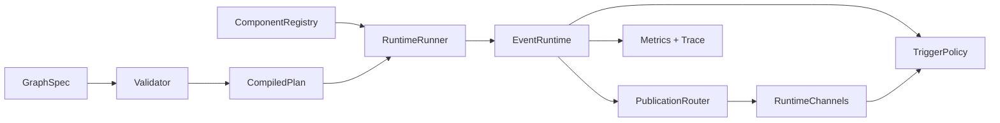

# TopoExec

TopoExec is a compact C++20 runtime for stateful in-process execution graphs. It gives applications explicit semantics for edge visibility, feedback loops, bounded channels, trigger readiness, payload ownership, metrics, and trace events without requiring a service framework.

TopoExec is not a distributed runtime, ROS adapter, Python framework, GUI editor, or OpenTelemetry/Prometheus exporter. Those adapter surfaces are deferred until the core runtime API is stable.

## Quickstart

```bash
cmake -S . -B build -DCMAKE_BUILD_TYPE=RelWithDebInfo
cmake --build build -j
ctest --test-dir build --output-on-failure
cmake --build build --target topoexec_format_check
./build/topoexec_app_cpp_builder_minimal
./build/topoexec graph run examples/minimal.yaml --steps 1
```

Dependencies are CMake, a C++20 compiler, `yaml-cpp`, `CLI11`, `nlohmann_json`, and GTest for tests. If GTest is not installed, the build fetches it through CMake `FetchContent`.

## Core Concepts

- `Component`: user code with lifecycle hooks and one `execute()` / `execute_status()` entry point.
- `GraphSpec`: declarative lanes, components, edges, and optional CompositeLoops.
- Edge kinds: `immediate`, `delay`, `state`, and `async`.
- Channel policy: latest, queue, barrier, previous-tick, overflow behavior, and copy policy.
- Trigger policy: manual, any/all input, time sync, batch, request, and task-ready.
- CompositeLoop: explicit owner for immediate feedback SCCs.



## Embedding

Pure C++ applications can link only the runtime target:

```cmake
find_package(topoexec CONFIG REQUIRED)
target_link_libraries(my_app PRIVATE topoexec::runtime)
```

Build graphs directly in C++ with `GraphSpec` or `topoexec/runtime/graph_builder.hpp`. `examples/apps/cpp_builder_minimal` is the minimal embeddable example. YAML loading and CLI tooling are optional through `topoexec::yaml`.

## CLI Tools

```bash
topoexec graph validate examples/minimal.yaml
topoexec graph plan examples/composite_loop.yaml --format json
topoexec graph render examples/composite_loop.yaml --format mermaid
topoexec graph run examples/minimal.yaml --steps 1
topoexec graph run examples/minimal.yaml --steps 10 --until-idle
topoexec graph metrics examples/minimal.yaml --steps 1 --format json
topoexec graph trace examples/minimal.yaml --steps 1
topoexec graph trace examples/minimal.yaml --steps 1 --format chrome > topoexec-trace.json
topoexec graph lint examples/control_feedback_delay.yaml
topoexec graph explain examples/minimal.yaml
topoexec graph diff-plan examples/minimal.yaml examples/control_feedback_delay.yaml
topoexec graph bench examples/minimal.yaml --steps 1 --runs 2
topoexec schema dump --format json
topoexec schema check examples/minimal.yaml --format json
topoexec doctor --format json
```

The CLI validates `schema_version: 1` graphs, emits text/JSON/Mermaid views, runs demo graphs, prints metrics/trace events, and provides lightweight lint/explain/diff/bench/schema/doctor output derived from the runtime contract.

## Examples

- `examples/apps/minimal_pipeline`: immediate source-transform-sink execution.
- `examples/apps/overload_latest_vs_queue`: latest overwrite versus bounded queue behavior.
- `examples/apps/control_feedback_delay`: feedback delayed to the next epoch.
- `examples/apps/composite_loop_fixed_point`: explicit immediate feedback owner.
- `examples/apps/async_worker`: async deferred delivery, bounded queue behavior, and overload semantics.
- `examples/apps/cpp_builder_minimal`: pure C++ graph builder path.

Each app directory includes a README with graph shape, run command, expected output, semantic lesson, and contrast case.

## Documentation

- [Runtime semantics](docs/runtime-semantics.md)
- [Schema v1](docs/schema-v1.md)
- [API overview](docs/api-overview.md)
- [Public API stability](docs/public-api.md)
- [Payloads and ownership](docs/payloads.md)
- [Scheduler semantics](docs/scheduler.md)
- [Concurrency](docs/concurrency.md)
- [Metrics](docs/metrics.md)
- [Trace events](docs/trace-events.md)
- [Performance baselines](docs/performance-baselines.md)
- [FAQ](docs/faq.md)
- [Adapter boundaries](docs/adapters.md)

Release planning is tracked in [CHANGELOG.md](CHANGELOG.md), [docs/versioning.md](docs/versioning.md), and [docs/release-checklist.md](docs/release-checklist.md). The latest published tag is `v0.1.0-alpha`; current `main` carries post-alpha concurrency and async admission work.
Plan execution is tracked in [docs/goals/backlog.md](docs/goals/backlog.md) and [docs/goals/status.md](docs/goals/status.md).

## Known Limitations

- `thread_pool` lanes support a bounded MVP for ready invocations, but priority, affinity, RT policy, persistent worker naming, and timeout-based preemption are advisory or not implemented.
- Async `policy.max_inflight` admission is implemented for `async` edges; it is an admission limit for deferred completions, not a general async task/future executor.
- Non-blocking ThreadSanitizer CI is wired for GitHub Actions and passed on current `main`; local `scripts/agent_check.sh` remains the required agent gate.
- ROS 2, OpenTelemetry, Prometheus, Python, and external Perfetto adapters are deferred.
