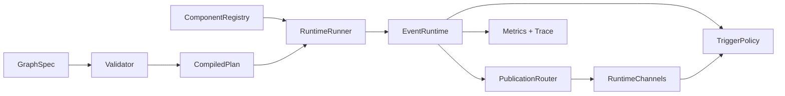

# TopoExec

TopoExec is a compact C++20 runtime for stateful in-process execution graphs. It gives embedders explicit semantics for edge visibility, feedback loops, bounded channels, trigger readiness, payload ownership, metrics, and trace events without requiring a service framework.

TopoExec is for applications that need deterministic, observable graph execution inside one process. It is not a distributed runtime, ROS adapter, Python framework, GUI editor, OpenTelemetry/Prometheus exporter, or sandboxed plugin system. Those ecosystem surfaces stay deferred or preview-only until the core runtime API is stable.

## Fast Start

```bash
cmake -S . -B build -DCMAKE_BUILD_TYPE=RelWithDebInfo
cmake --build build -j
ctest --test-dir build --output-on-failure
cmake --build build --target topoexec_format_check
./build/topoexec_app_cpp_builder_minimal
./build/topoexec graph run examples/minimal.yaml --steps 1
```

Dependencies are CMake, a C++20 compiler, `yaml-cpp`, `CLI11`, `nlohmann_json`, and GTest for tests. If GTest is not installed, the build fetches it through CMake `FetchContent`.

Start with [Getting started](docs/01-quickstart/getting-started.md), then use the [documentation map](docs/README.md) for the full reader path.

## Runtime Shape

TopoExec compiles a `GraphSpec` into ordered runtime regions, validates the component and edge contract, then runs components through `RuntimeRunner` and `EventRuntime`.



The core vocabulary is in [Concepts](docs/10-user-overview/concepts.md). The implementation-level architecture is in [Runtime architecture](docs/21-architecture/runtime-architecture.md) and [Codebase map](docs/22-codebase/codebase-map.md).

## Embedding

Pure C++ applications can link only the runtime target:

```cmake
find_package(topoexec CONFIG REQUIRED)
target_link_libraries(my_app PRIVATE topoexec::runtime)
```

Use `GraphSpec` directly or the convenience builder in `topoexec/runtime/graph_builder.hpp`. YAML loading and CLI tooling are optional through `topoexec::yaml`; dependency-free preview boundaries exist for adapters, C API, Python automation, and plugin loading.

## Entry Points

- Learn and run: [Getting started](docs/01-quickstart/getting-started.md), [Cookbook](docs/11-user-guide/cookbook.md), [Examples](docs/11-user-guide/examples.md).
- Understand semantics: [Runtime semantics](docs/21-architecture/runtime-semantics.md), [Runtime semantic contract](docs/21-architecture/semantic-contract.md), [Schema v1](docs/33-specs-rfcs/schema-v1.md).
- Embed or extend: [API overview](docs/61-api/api-overview.md), [Public API stability](docs/61-api/public-api.md), [Adapter boundaries](docs/12-integrations/adapter-boundaries.md).
- Maintain the project: [Maintainer map](docs/20-development-overview/maintainer-map.md), [Testing strategy](docs/24-testing/testing-strategy.md), [Build and package](docs/43-ci-build-release-tools/build-and-package.md), [Contributing](docs/44-coding-standards/contributing.md).
- Generated docs: the repository now includes optional Doxygen API-reference and GitHub Pages site wiring, documented in [Doxygen](docs/61-api/doxygen.md) and [GitHub Pages](docs/45-doc-standards/github-pages.md). A public Pages URL is intentionally omitted until the workflow deploys successfully.

Release planning and goal history live under [planning and roadmap](docs/31-planning-roadmap/goals/backlog.md). The latest published tag is `v0.1.0-alpha`; current `main` carries post-alpha runtime, packaging, adapter-SDK, docs, example, release-automation, pilot-app, and core-runtime beta-readiness review work.

## Known Limitations

- `thread_pool` lanes support bounded runtime-priority admission and cooperative cancellation/timeout observation for ready invocations, but affinity, RT policy, portable worker-name guarantees, advanced starvation aging, and hard timeout preemption remain advisory or not implemented.
- Async `policy.max_inflight` admission is implemented for `async` edges; it is an admission limit for deferred completions, while optional `TaskExecutor` / `ThreadedTaskExecutor` helpers are separate bounded task-execution surfaces.
- CompositeLoop `solver_iteration` supports in-process residual/convergence reporting and explicit partial-success output policy; external solver plugins and optimizer dependencies are not implemented.
- Trigger v2 `watermark`, `condition`, `debounce`, and `rate_limit` policies are declarative previews; arbitrary trigger scripts and wall-clock debounce timers are not implemented.
- Production ROS 2 packages, production OpenTelemetry/Prometheus, native Python bindings, stable C ABI, sandboxed/stable dynamic plugin ecosystems, schema v2 implementation/migration tooling, and external Perfetto adapters are deferred.
- The beta readiness review covers only a possible core-runtime beta candidate; adapter/ecosystem beta readiness, hard real-time scheduling, signed release uploads, and package-registry publication remain deferred.
