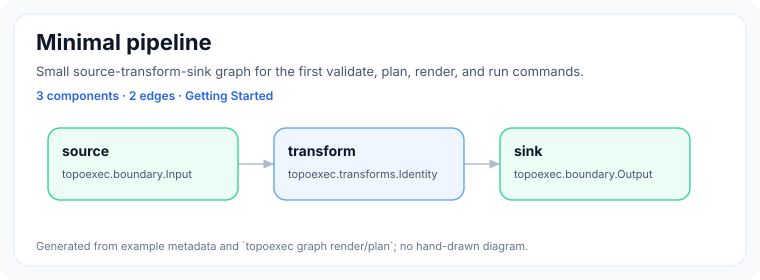
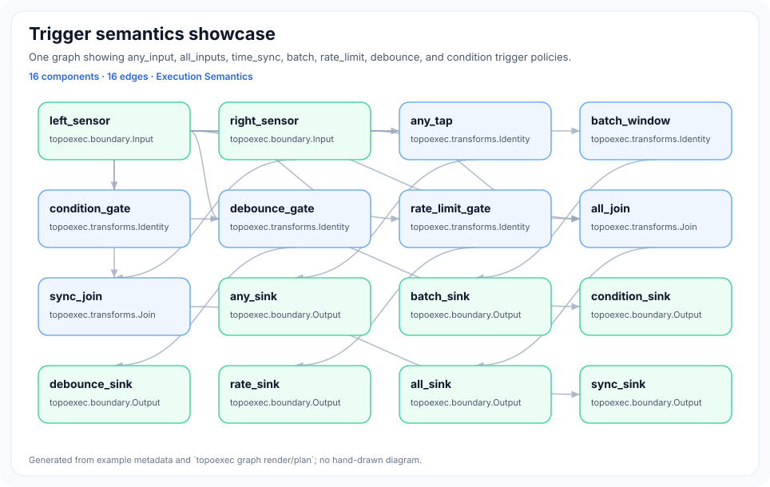
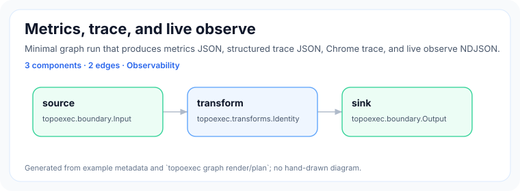
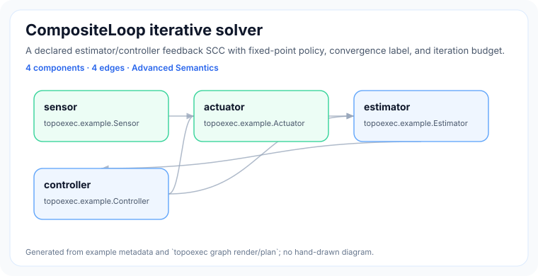

# TopoExec

**TopoExec is a C++20 graph runtime for deterministic, observable, and testable in-process dataflow execution.**

Deterministic · Observable · Testable · Composable · CLI-first


TopoExec is for embedders who want explicit graph semantics without adopting a
service framework. It validates graph structure, compiles execution regions,
runs bounded local graphs, and exposes plan/render/metrics/trace/live-observe
surfaces that make runtime behavior inspectable.

> **Project status:** beta / pre-production. TopoExec has extensive local tests,
> validation, observability, packaging, and documentation gates, but it is not
> advertised as production-proven or deployed at scale.

## Why TopoExec?

- Declarative graph specification with schema and semantic validation.
- Deterministic execution regions for local in-process runtime behavior.
- Rich trigger, async, channel, and CompositeLoop semantics beyond a simple task runner.
- Built-in plan/render, metrics, trace, diagnostics, and live observe tooling.
- Stable, smokeable examples designed for CI and golden-output checks.
- Small C++20-first core; adapters and ecosystem integrations stay behind clear boundaries.

## Quick Start

```bash
cmake -S . -B build -DCMAKE_BUILD_TYPE=RelWithDebInfo
cmake --build build -j
./build/topoexec graph validate examples/00-getting-started/minimal.yaml
./build/topoexec graph plan examples/00-getting-started/minimal.yaml --format json
./build/topoexec graph render examples/00-getting-started/minimal.yaml --format mermaid
./build/topoexec graph run examples/00-getting-started/minimal.yaml --steps 1
```

Expected run summary:

```text
ok
graph: minimal
ticks: 3
stop_reason: tick_bound
channel_publish_count: 2
channel_delivery_count: 2
```

Dependencies are CMake, a C++20 compiler, `yaml-cpp`, `CLI11`,
`nlohmann_json`, and GTest for tests. If GTest is unavailable, the build fetches
it through CMake `FetchContent`.

## Visual Showcase

These images are generated from real example metadata and `topoexec` CLI output,
not hand-maintained screenshots.

| Example | What it shows |
| --- | --- |
| [](examples/00-getting-started/) | The smallest source → transform → sink path for validate, plan, render, and run. |
| [](examples/20-triggers/) | `any_input`, `all_inputs`, `time_sync`, `batch`, `rate_limit`, `debounce`, and `condition` policies in one graph. |
| [](examples/50-observability/) | Metrics, structured trace, Chrome trace, and live observe NDJSON from a real run. |
| [](examples/40-composite-loop/) | A declared estimator/controller feedback SCC with fixed-point loop policy. |

Regenerate or check the gallery:

```bash
python3 scripts/update_examples_index.py --check
python3 scripts/render_example_assets.py --topoexec build/topoexec --check
```

## Core Capabilities

| Capability | What it means |
| --- | --- |
| Validation | Catch graph/config problems before runtime with schema and semantic checks. |
| Plan & render | Inspect compiled regions and topology as JSON or Mermaid/SVG assets. |
| Triggers | Express readiness/suppression with `any_input`, `all_inputs`, `time_sync`, `batch`, `condition`, `debounce`, and `rate_limit`. |
| Async | Model deferred completions with bounded queue capacity and `max_inflight`. |
| Composite loops | Declare controlled immediate feedback SCCs with convergence and budget policy. |
| Metrics & trace | Inspect runtime counters, structured trace events, Chrome trace, and live observe streams. |
| Testing support | Use deterministic JSON/text outputs, examples metadata, and focused gates in CI. |

## Example Gallery

Start at [`examples/README.md`](examples/README.md) for the generated learning path.

| Path | Purpose |
| --- | --- |
| [`examples/00-getting-started/`](examples/00-getting-started/) | Minimal pipeline and first CLI commands. |
| [`examples/10-basic-dataflow/`](examples/10-basic-dataflow/) | Branching, fan-out, and merge/join behavior. |
| [`examples/20-triggers/`](examples/20-triggers/) | Trigger readiness and suppression policies. |
| [`examples/30-async/`](examples/30-async/) | Async worker edge with bounded inflight. |
| [`examples/40-composite-loop/`](examples/40-composite-loop/) | Declared iterative feedback loop. |
| [`examples/50-observability/`](examples/50-observability/) | Metrics, trace, Chrome trace, and live observe output. |
| [`examples/60-testing-validation/`](examples/60-testing-validation/) | Clear validation diagnostics and golden-friendly output. |
| [`examples/70-performance/`](examples/70-performance/) | Local benchmark smoke without cross-machine claims. |
| [`examples/80-realistic-mini-scenario/`](examples/80-realistic-mini-scenario/) | Synthetic robot-cell-inspired mini pipeline. |
| [`examples/90-dogfood-pilot/`](examples/90-dogfood-pilot/) | Synthetic dogfood pilot with metrics, trace, live assertions, and benchmark smoke. |

## Documentation

- First run: [Getting started](docs/01-quickstart/getting-started.md), [Examples guide](docs/11-user-guide/examples.md), [Cookbook](docs/11-user-guide/cookbook.md).
- Runtime semantics: [Concepts](docs/10-user-overview/concepts.md), [Runtime architecture](docs/21-architecture/runtime-architecture.md), [Runtime semantics](docs/21-architecture/runtime-semantics.md), [Semantic contract](docs/21-architecture/semantic-contract.md).
- Tooling: [CLI reference](docs/41-development-tools/cli.md), [Live runtime validation](docs/41-development-tools/live-runtime-validation.md), [Metrics schema](docs/62-schemas-protocols/metrics.md), [Trace events](docs/62-schemas-protocols/trace-events.md).
- Embedding/API: [API overview](docs/61-api/api-overview.md), [Public API stability](docs/61-api/public-api.md), [Adapter boundaries](docs/12-integrations/adapter-boundaries.md).
- Maintenance: [Testing strategy](docs/24-testing/testing-strategy.md), [Build and package](docs/43-ci-build-release-tools/build-and-package.md), [Contributing](docs/44-coding-standards/contributing.md), [Roadmap backlog](docs/31-planning-roadmap/goals/backlog.md).

## Embedding

Pure C++ applications can link only the runtime target:

```cmake
find_package(topoexec CONFIG REQUIRED)
target_link_libraries(my_app PRIVATE topoexec::runtime)
```

Use `GraphSpec` directly or the convenience builder in
`topoexec/runtime/graph_builder.hpp`. YAML loading and CLI tooling are optional
through `topoexec::yaml`; dependency-free preview boundaries exist for adapters,
C API, Python automation, and plugin loading.

## Project Boundaries

TopoExec is a compact local runtime, not a distributed workflow platform. The
following remain deferred, preview-only, or intentionally out of scope unless a
future goal explicitly opens them:

- full GUI editor, LSP, or production dashboard platform;
- production ROS 2 package/client-library adapter;
- production OpenTelemetry or Prometheus exporters;
- native Python bindings, stable C ABI, or sandboxed plugin ecosystem;
- schema v2 migration tooling and external Perfetto adapter;
- hard real-time scheduling, affinity, preemption, or production timing claims.

`graph observe` is a local observability and test-validation surface. It is
disabled by default at runtime, bounded when enabled, and does not provide
runtime control, pause/resume/step, fault injection, remote multi-user access,
or production telemetry export.

## Contributing and License

See [Contributing](CONTRIBUTING.md), the [code of conduct](CODE_OF_CONDUCT.md),
and the [Apache-2.0 license](LICENSE).
