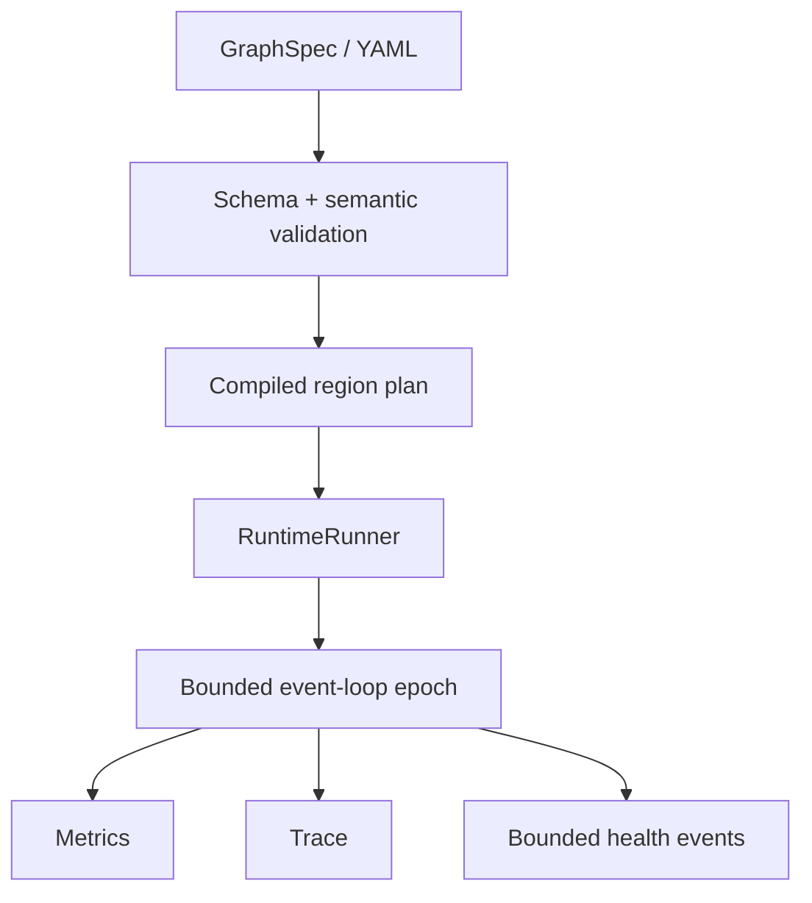
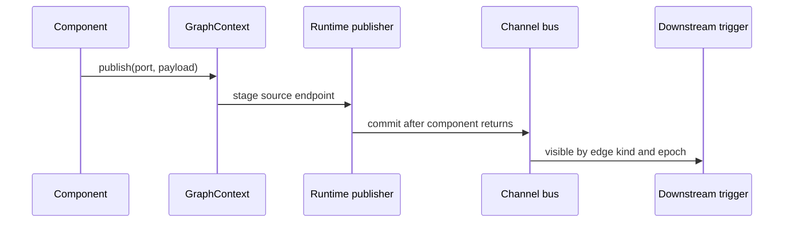
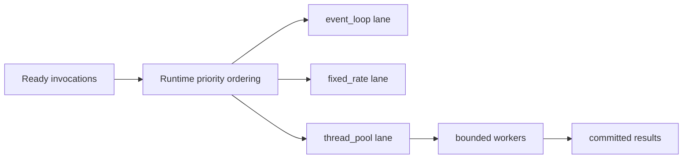
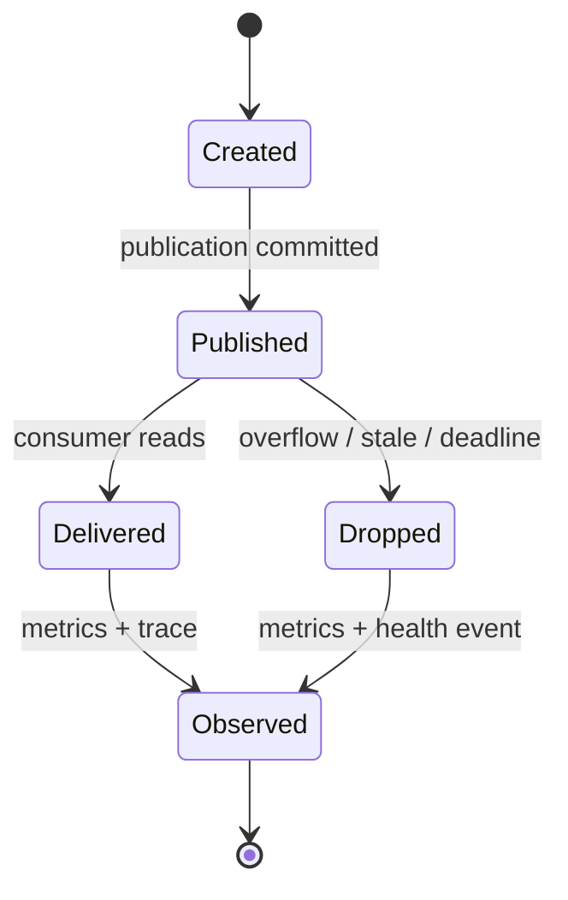

# Architecture Diagrams

These diagrams are documentation aids for the current in-process runtime. They do
not imply external adapters or distributed execution.

## Runtime flow

## Publication routing

## Scheduler lanes

## Channel lifecycle

